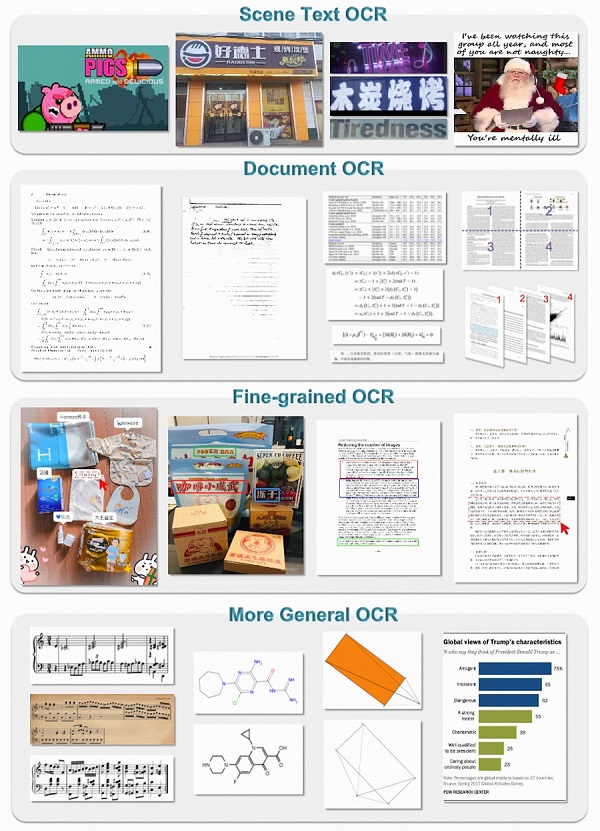

<h3><a href="">General OCR Theory: Towards OCR-2.0 via a Unified End-to-end Model</a></h3>

<a href="https://huggingface.co/ucaslcl/GOT-OCR2_0"></a>
<a href="https://modelscope.cn/models/stepfun-ai/GOT-OCR2_0"></a>
<a href="https://arxiv.org/abs/2409.01704"></a> 
<a href="https://zhuanlan.zhihu.com/p/718163422"></a> 
<a href="https://huggingface.co/spaces/ucaslcl/GOT_online"></a> 

[Haoran Wei*](https://scholar.google.com/citations?user=J4naK0MAAAAJ&hl=en), Chenglong Liu*, Jinyue Chen, Jia Wang, Lingyu Kong, Yanming Xu,  [Zheng Ge](https://joker316701882.github.io/), Liang Zhao, [Jianjian Sun](https://scholar.google.com/citations?user=MVZrGkYAAAAJ&hl=en), [Yuang Peng](https://yuangpeng.com), Chunrui Han, [Xiangyu Zhang](https://scholar.google.com/citations?user=yuB-cfoAAAAJ&hl=en)

<p align="center">

</p>


## Release
- [2025/2/1] 🚀🚀🚀 GOT-OCR2.0 is merged to [Huggingface-transformers](https://huggingface.co/stepfun-ai/GOT-OCR-2.0-hf)/[space](https://huggingface.co/spaces/yonigozlan/GOT-OCR-Transformers). It supports inference batched. Thanks to the MLE of Huggingface [Yoni](https://github.com/yonigozlan).
- [2024/12/24] 🔥🔥🔥 My new work on system-2 perception is released [slow-perception](https://github.com/Ucas-HaoranWei/Slow-Perception).
- [2024/12/18] 🚀🚀🚀 GOT-OCR2.0 is supported in [PaddleMIX](https://github.com/PaddlePaddle/PaddleMIX/tree/develop/paddlemix/examples/GOT_OCR_2_0) by Paddle Team. Thanks for the Paddle team!
- [2024/12/8] 🔥🔥🔥 The model download has exceeded 1M on [Huggingface](https://huggingface.co/stepfun-ai/GOT-OCR2_0).
- [2024/12/5] The seven wechat [group](https://github.com/Ucas-HaoranWei/GOT-OCR2.0/blob/main/assets/Wechat7.jpg).
- [2024/11/4] The six wechat [group](https://github.com/Ucas-HaoranWei/GOT-OCR2.0/blob/main/assets/wechat6-2.jpg).
- [2024/10/24] The previous four wechat groups are full, so we created a fifth [group](https://github.com/Ucas-HaoranWei/GOT-OCR2.0/blob/main/assets/wechat5.png).
- [2024/10/11] Too many friends want to join the wechat group, so we created a fourth [group](https://github.com/Ucas-HaoranWei/GOT-OCR2.0/blob/main/assets/wechat4.jpg).
- [2024/10/2] [onnx](https://github.com/BaofengZan/GOT-OCRv2-onnx) and [mnn](https://github.com/BaofengZan/mnn-llm-GOT-OCR2.0) versions of GOT-OCR2.0.
- [2024/9/29]🔥🔥🔥 The community has implemented the first version of [llama_cpp_inference](https://github.com/1694439208/GOT-OCR-Inference).
- [2024/9/24]🔥🔥🔥 Support [ms-swift](https://github.com/modelscope/ms-swift/issues/2122) quick [Fine-tune](#fine-tune) for your own data. 
- [2024/9/23]🔥🔥🔥 We release the official [Modelscope demo](https://modelscope.cn/studios/stepfun-ai/GOT_official_online_demo). Thanks very much for Modelscope providing the GPU resource.
- [2024/9/19]🔥🔥🔥 GOT-OCR2.0 achieves Huggingface trending #1.
- [2024/9/14]🔥🔥🔥 We release the official [demo](https://huggingface.co/spaces/ucaslcl/GOT_online). Thanks very much for Huggingface providing the GPU resource. 
- [2024/9/13]🔥🔥🔥 We release the [Huggingface](https://huggingface.co/ucaslcl/GOT-OCR2_0) deployment. 
- [2024/9/03]🔥🔥🔥 We open-source the codes, weights, and benchmarks. The paper can be found in this [repo](https://github.com/Ucas-HaoranWei/GOT-OCR2.0/blob/main/GOT-OCR-2.0-paper.pdf). We also have submitted it to Arxiv. 
- [2024/9/03]🔥🔥🔥 We release the OCR-2.0 model GOT! 


[](https://github.com/tatsu-lab/stanford_alpaca/blob/main/LICENSE)
[](https://github.com/tatsu-lab/stanford_alpaca/blob/main/DATA_LICENSE)


## Community contributions
We encourage everyone to develop GOT applications based on this repo. Thanks for the following contributions :

[OpenVINO](https://github.com/can-gaa-hou/GOT-OCR2.0-OpenVINO)~ contributor: [@can-gaa-hou](https://github.com/can-gaa-hou)

[GGUF and Llama.cpp inference](https://github.com/MosRat/got.cpp)~ contributor: [@MosRat](https://github.com/MosRat)

[vllm reference](https://github.com/liunian-Jay/MU-GOT/blob/master/PDF_parsing/GOT/GOT/model/modeling_GOT_vllm.py) ~ contributor: [@Jay](https://github.com/liunian-Jay)

[onnx and mnn supports](https://github.com/BaofengZan/GOT-OCRv2-onnx) ~ contributor: [@BaofengZan](https://github.com/BaofengZan)

[llama_cpp inference](https://github.com/1694439208/GOT-OCR-Inference) ~ contributor: [@1694439208](https://github.com/1694439208)

[Colab of GOT](https://colab.research.google.com/drive/1nmiNciZ5ugQVp4rFbL9ZWpEPd92Y9o7p?usp=sharing)   ~      contributor: [@Zizhe Wang](https://github.com/PaperPlaneDeemo)

[CPU version of GOT](https://github.com/ElvisClaros/GOT-OCR2.0) ~ contributor: [@ElvisClaros](https://github.com/ElvisClaros)

[Online demo](https://huggingface.co/spaces/Tonic/GOT-OCR) ~ contributor: [@Joseph Pollack](https://huggingface.co/Tonic)

[Dokcer & client demo](https://github.com/QIN2DIM/GOT-OCR2.0) ~ contributor: [@QIN2DIM](https://github.com/QIN2DIM) 

[GUI of GOT](https://github.com/XJF2332/GOT-OCR-2-GUI) ~ contributor: [@XJF2332](https://github.com/XJF2332) 

## Contents
- [Install](#install)
- [GOT Weights](#got-weights)
- [Benchmarks](#benchmarks)
- [Demo](#demo)
- [Train](#train)
- [Fine-tune](#fine-tune)
- [Eval](#eval)

***
<p align="center">

</p>
<p align="center">
<a href="">Towards OCR-2.0 via a Unified End-to-end Model</a>       
</p>

***


## Install
0. Our environment is cuda11.8+torch2.0.1
1. Clone this repository and navigate to the GOT folder
```bash
git clone https://github.com/Ucas-HaoranWei/GOT-OCR2.0.git
cd 'the GOT folder'
```
2. Install Package
```Shell
conda create -n got python=3.10 -y
conda activate got
pip install -e .
```

3. Install Flash-Attention
```
pip install ninja
pip install flash-attn --no-build-isolation
```
## GOT Weights
- [Huggingface](https://huggingface.co/ucaslcl/GOT-OCR2_0)
- [Google Drive](https://drive.google.com/drive/folders/1OdDtsJ8bFJYlNUzCQG4hRkUL6V-qBQaN?usp=sharing)
- [BaiduYun](https://pan.baidu.com/s/1G4aArpCOt6I_trHv_1SE2g) code: OCR2

## Benchmarks
- [Google Drive](https://drive.google.com/drive/folders/1OdDtsJ8bFJYlNUzCQG4hRkUL6V-qBQaN?usp=sharing)
- [BaiduYun](https://pan.baidu.com/s/1G4aArpCOt6I_trHv_1SE2g) code: OCR2

## Demo
1. plain texts OCR:
```Shell
python3 GOT/demo/run_ocr_2.0.py  --model-name  /GOT_weights/  --image-file  /an/image/file.png  --type ocr
```
2. format texts OCR:
```Shell
python3 GOT/demo/run_ocr_2.0.py  --model-name  /GOT_weights/  --image-file  /an/image/file.png  --type format
```
3. fine-grained OCR:
```Shell
python3 GOT/demo/run_ocr_2.0.py  --model-name  /GOT_weights/  --image-file  /an/image/file.png  --type format/ocr --box [x1,y1,x2,y2]
```
```Shell
python3 GOT/demo/run_ocr_2.0.py  --model-name  /GOT_weights/  --image-file  /an/image/file.png  --type format/ocr --color red/green/blue
```
4. multi-crop OCR:
```Shell
python3 GOT/demo/run_ocr_2.0_crop.py  --model-name  /GOT_weights/ --image-file  /an/image/file.png 
```
5. **Note**: This feature is not batch inference!! It works on the token level.  Please read the paper and then correct use multi-page OCR (the image path contains multiple .png files):
```Shell
python3 GOT/demo/run_ocr_2.0_crop.py  --model-name  /GOT_weights/ --image-file  /images/path/  --multi-page
```
6. render the formatted OCR results:
```Shell
python3 GOT/demo/run_ocr_2.0.py  --model-name  /GOT_weights/  --image-file  /an/image/file.png  --type format --render
 ```
**Note**:
The rendering results can be found in /results/demo.html. Please open the demo.html to see the results.


## Train
0. Train sample can be found [here](https://github.com/Ucas-HaoranWei/GOT-OCR2.0/blob/main/assets/train_sample.jpg). Note that the '\<image>' in the 'conversations'-'human'-'value' is necessary!
1. This codebase only supports post-training (stage-2/stage-3) upon our GOT weights.
2. If you want to train from stage-1 described in our paper, you need this [repo](https://github.com/Ucas-HaoranWei/Vary-tiny-600k).

```Shell
deepspeed   /GOT-OCR-2.0-master/GOT/train/train_GOT.py \
 --deepspeed /GOT-OCR-2.0-master/zero_config/zero2.json    --model_name_or_path /GOT_weights/ \
 --use_im_start_end True   \
 --bf16 True   \
 --gradient_accumulation_steps 2    \
 --evaluation_strategy "no"   \
 --save_strategy "steps"  \
 --save_steps 200   \
 --save_total_limit 1   \
 --weight_decay 0.    \
 --warmup_ratio 0.001     \
 --lr_scheduler_type "cosine"    \
 --logging_steps 1    \
 --tf32 True     \
 --model_max_length 8192    \
 --gradient_checkpointing True   \
 --dataloader_num_workers 8    \
 --report_to none  \
 --per_device_train_batch_size 2    \
 --num_train_epochs 1  \
 --learning_rate 2e-5   \
 --datasets pdf-ocr+scence \
 --output_dir /your/output/path
```


**Note**:
1. Change the corresponding data information in [constant.py](https://github.com/Ucas-HaoranWei/GOT-OCR2.0/tree/main/GOT-OCR-2.0-master/GOT/utils).
2. Change line 37 in [conversation_dataset_qwen.py](https://github.com/Ucas-HaoranWei/GOT-OCR2.0/tree/main/GOT-OCR-2.0-master/GOT/data) to your data_name.

## Fine-tune
Quick Fine-tune with ms-swift:

```Shell
git clone https://github.com/modelscope/ms-swift.git
cd ms-swift
pip install -e .[llm]
```
```Shell
# default：sft LLM & projector, freeze vision encoder
CUDA_VISIBLE_DEVICES=0 swift sft\
--model_type got-ocr2 \
--model_id_or_path stepfun-ai/GOT-OCR2_0 \
--sft_type lora \
--dataset latex-ocr-print#5000

# Deepspeed ZeRO2
NPROC_PER_NODE=4 \
CUDA_VISIBLE_DEVICES=0,1,2,3 swift sft \
--model_type got-ocr2 \
--model_id_or_path stepfun-ai/GOT-OCR2_0 \
--sft_type lora \
--dataset latex-ocr-print#5000 \
--deepspeed default-zero2
```

**With your data**:
```Shell
--dataset train.jsonl
--val_dataset val.jsonl (optional)
```
**Data format**:
```Shell
{"query": "<image>55555", "response": "66666", "images": ["image_path"]}
{"query": "<image><image>eeeee", "response": "fffff", "history": [], "images": ["image_path1", "image_path2"]}
{"query": "EEEEE", "response": "FFFFF", "history": [["query1", "response1"], ["query2", "response2"]]}
```
More details can be seen in [ms-swift](https://github.com/modelscope/ms-swift/issues/2122).

## Eval
1. We use the [Fox](https://github.com/ucaslcl/Fox) and [OneChart](https://github.com/LingyvKong/OneChart) benchmarks, and other benchmarks can be found in the weights download link.
2. The eval codes can be found in GOT/eval.
3. You can use the evaluate_GOT.py to run the eval. If you have 8 GPUs， the --num-chunks can be set to 8.
 ```Shell
python3 GOT/eval/evaluate_GOT.py --model-name /GOT_weights/ --gtfile_path xxxx.json --image_path  /image/path/ --out_path /data/eval_results/GOT_mathpix_test/ --num-chunks 8 --datatype OCR
```

## Contact
If you are interested in this work or have questions about the code or the paper, please join our communication [Wechat](https://github.com/Ucas-HaoranWei/GOT-OCR2.0/blob/main/assets/wechat.jpg) group.

**Note**:
All six wechat groups are full, please join [group 7](https://github.com/Ucas-HaoranWei/GOT-OCR2.0/blob/main/assets/Wechat7.jpg).

Don't hesitate to contact me by email, weihaoran18@mails.ucas.ac.cn, if you have any questions.

## Acknowledgement
- [Vary](https://github.com/Ucas-HaoranWei/Vary/): the codebase we built upon!
- [Qwen](https://github.com/QwenLM/Qwen): the LLM base model of Vary, which is good at both English and Chinese!


## Citation
```bibtex
@article{wei2024general,
  title={General OCR Theory: Towards OCR-2.0 via a Unified End-to-end Model},
  author={Wei, Haoran and Liu, Chenglong and Chen, Jinyue and Wang, Jia and Kong, Lingyu and Xu, Yanming and Ge, Zheng and Zhao, Liang and Sun, Jianjian and Peng, Yuang and others},
  journal={arXiv preprint arXiv:2409.01704},
  year={2024}
}
@article{wei2023vary,
  title={Vary: Scaling up the Vision Vocabulary for Large Vision-Language Models},
  author={Wei, Haoran and Kong, Lingyu and Chen, Jinyue and Zhao, Liang and Ge, Zheng and Yang, Jinrong and Sun, Jianjian and Han, Chunrui and Zhang, Xiangyu},
  journal={arXiv preprint arXiv:2312.06109},
  year={2023}
}


